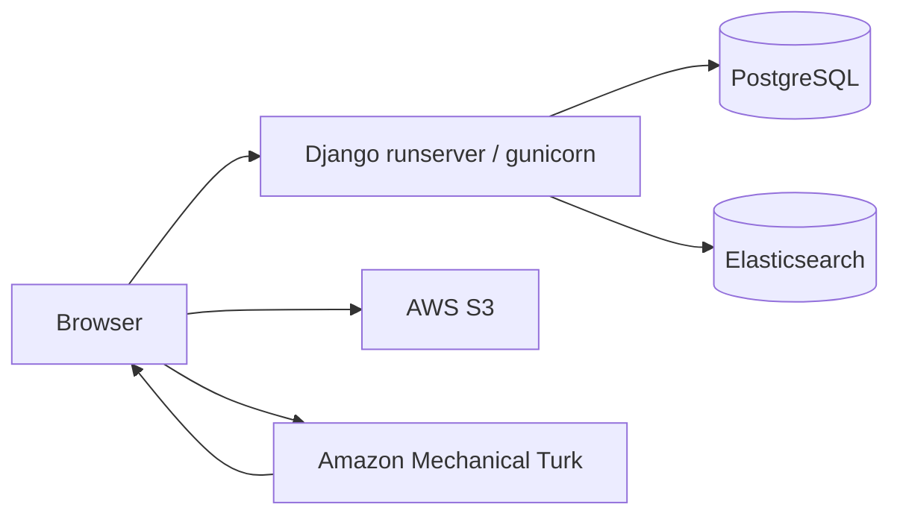

# Image Labeler — Application Documentation

This repository is a **single Django 5 project** with two cooperating parts:

1. **`label_images`** — Browser UI (templates + static JS) for reviewing and submitting labels.
2. **`labeling_api`** — HTTP API (`get_*`, `collect_*`, etc.) that talks to PostgreSQL, Elasticsearch, S3, and optional ML/embeddings.

The UI used to call a **remote** API on Render (`https://backend-python-nupj.onrender.com`). It can still do that, or you can run **one Django process** that serves both the UI and the API on the same origin (recommended for local development).

---

## High-level architecture

- **Same-origin mode**: Set `LABELING_API_BASE_URL` to your site origin (e.g. `http://127.0.0.1:8000`). Server-side `requests` in `label_images` and browser `fetch` in `api_calls.js` both hit the mounted `labeling_api` routes.
- **Split / remote mode**: Point `LABELING_API_BASE_URL` at another host (e.g. the Render URL). CORS must allow your UI origin if the browser calls cross-origin.
- **Browser → S3**: Color-map PNGs use the AWS SDK in the browser with keys from `/get_config/` (see Security).

---

## Repository layout

| Area                | Path                                      | Role                                                                                                    |
| ------------------- | ----------------------------------------- | ------------------------------------------------------------------------------------------------------- |
| Django settings     | `image_labeler/image_labeler/settings.py` | DB, CORS, `API_ACCESS_KEY`, `LABELING_API_BASE_URL`, Elasticsearch, MTurk env, static                   |
| Root URLconf        | `image_labeler/image_labeler/urls.py`     | Admin, `/get_config/`, **`include('labeling_api.urls')`** at URL root, `label_images`, `/` → front page |
| Labeling API routes | `labeling_api/urls.py`                    | `get_color_labels/`, `collect_label/`, … (same paths as the old hosted API)                             |
| UI routes           | `image_labeler/label_images/urls.py`      | `/label_images/...`                                                                                     |
| UI page logic       | `image_labeler/label_images/views.py`     | Builds `api_url` with `settings.LABELING_API_BASE_URL`                                                  |
| API implementation  | `labeling_api/views.py`                   | REST-style handlers, DB/ES access                                                                       |
| API ORM (unmanaged) | `labeling_api/models.py`                  | Maps to `content.*`, `label_data.*`, etc.                                                               |
| Auth helper         | `api/decorators.py`                       | `api_authorization` checks `Authorization` vs `API_ACCESS_KEY`                                          |
| Frontend API client | `image_labeler/static/js/api_calls.js`    | `labelApi()` + `/get_config/`                                                                           |
| Templates           | `image_labeler/templates/`                | `site_header.html` sets `window.LABELING_API_BASE_URL`                                                  |
| Offline tools       | `image_labeler/new_labels/`               | Batch prep scripts (not request handlers)                                                               |

---

## URL routing (site root)

**`image_labeler/image_labeler/urls.py`**

| Path                                       | Handler                                                      |
| ------------------------------------------ | ------------------------------------------------------------ |
| `/admin/`                                  | Django admin                                                 |
| `/label_images/`                           | UI (`label_images.urls`)                                     |
| `/get_config/`                             | JSON config for the browser (keys + `LABELING_API_BASE_URL`) |
| `/get_color_labels/`, `/collect_label/`, … | **Labeling API** (`labeling_api.urls`, mounted at `""`)      |
| `/`                                        | Redirect to `/label_images/front_page/`                      |

So in **same-origin** mode, the API base is literally your site origin: paths are `/get_asset_batch/`, not `/api/get_asset_batch/`.

---

## Configuration

### `LABELING_API_BASE_URL` (required concept)

- **Local, unified server**: `LABELING_API_BASE_URL=http://127.0.0.1:8000` (no trailing slash). UI and API share one process; cookies/origin stay aligned.
- **Production UI + remote API (legacy)**: `LABELING_API_BASE_URL=https://backend-python-nupj.onrender.com`
- Wired in:
  - **Python**: `label_images/views.py` → `f"{settings.LABELING_API_BASE_URL}/…"`
  - **Templates**: `site_header.html` → `window.LABELING_API_BASE_URL`
  - **JS**: `api_calls.js` → `labelApi()` and `/get_config/` merge
  - **`get_config`**: returns `LABELING_API_BASE_URL` for clients that load keys asynchronously

### Other environment variables

| Variable                                            | Role                                                                                                                                                                                                                                                                                           |
| --------------------------------------------------- | ---------------------------------------------------------------------------------------------------------------------------------------------------------------------------------------------------------------------------------------------------------------------------------------------- |
| `DJANGO_KEY`                                        | Django `SECRET_KEY`                                                                                                                                                                                                                                                                            |
| `API_ACCESS_KEY`                                    | Must match on **every** request that uses `@api_authorization`. **`LABELING_API_BASE_URL`** must point at the **same** deployment (default local: `http://127.0.0.1:8000`; default on Render: this app’s URL). Pointing at the old separate backend host with a local key causes **HTTP 401**. |
| `AWS_*`                                             | Exposed to browser via `/get_config/` for S3 color maps                                                                                                                                                                                                                                        |
| `ELASTICSEARCH_HOSTS`                               | Comma-separated URLs (default `http://127.0.0.1:9200`) → `settings.ELASTICSEARCH_DSL`                                                                                                                                                                                                          |
| `MTURK_ACCESS_ID`, `MTURK_SECRET_KEY`, `MTURK_HOST` | Used where `labeling_api` talks to MTurk                                                                                                                                                                                                                                                       |
| `RENDER`                                            | When `true`, `DEBUG` is off (see `settings.py`)                                                                                                                                                                                                                                                |

### Database

- **`DATABASES`** is **PostgreSQL only** (no SQLite). Set **`DATABASE_URL`** or **`POSTGRES_DB` + `POSTGRES_USER`** (see `settings.py`). Tables must match production schemas (`content.*`, `label_data.*`, `model_predictions.*`, …).
- **`content.extracted_features`** is optional: used only for **`get_search_results`** title filtering. If it is missing, that endpoint skips the filter. Session options and asset batches use **`label_data.selected_assets_new`** (`asset_type`, `color_type`).

### Optional ML / search stack

- **Embeddings search** (`get_search_results`, etc.) needs **torch**, **sentence_transformers**, **transformers**, PCA pickles under `labeling_api/modeling_files/`, and a working **Elasticsearch** index. If `sentence_transformers` is not installed, `labeling_api.apps` skips loading heavy models; embedding endpoints will error until dependencies and ES are available.
- **`SILENCED_SYSTEM_CHECKS`**: `fields.E120` is silenced because many legacy unmanaged models use `CharField()` without `max_length`. Prefer fixing fields over relying on silence long-term.

---

## Security

- `/get_config/` still exposes `API_ACCESS_KEY` and AWS keys to the browser — acceptable only in a trusted operator setting.
- **`api_authorization`** enforces the shared secret when `API_ACCESS_KEY` is set in the environment.

---

## Mechanical Turk

- CORS allows sandbox/production MTurk origins; `X_FRAME_OPTIONS = 'ALLOWALL'` for iframe embedding.
- Submit URL is chosen in `label_content.html` (`sandbox_flag`).

---

## Running locally

1. Virtualenv: `pip install -r image_labeler/requirements.txt` (add **elasticsearch**, **torch**, **sentence_transformers**, etc., when you need search/embeddings).
2. `.env`: **`DATABASE_URL`** (or `POSTGRES_DB` + `POSTGRES_USER`, etc.), plus `DJANGO_KEY`, `API_ACCESS_KEY`, and for unified mode `LABELING_API_BASE_URL=http://127.0.0.1:8000`.
3. `cd image_labeler` → `python manage.py migrate` → `python manage.py runserver`.
4. Open `http://127.0.0.1:8000/`.

---

## Operational notes (unchanged behaviors)

- **`view_labels`** can be slow (large pandas joins).
- Some JSON keys in views assume backend response shapes (`labeling_rules` vs `labelling_rules`, `mistmatched_labels`).
- Duplicate template locations: `templates/` vs `label_images/templates/`.

---

## Summary

The **UI** (`label_images`) and **API** (`labeling_api`) live in one Django project. **Point everything at the same base URL** via `LABELING_API_BASE_URL` and mount the API at the site root so paths match the old hosted service. **PostgreSQL is required** for Django (`DATABASE_URL` / `POSTGRES_*`). Optional: Elasticsearch and ML deps for search/embeddings.
